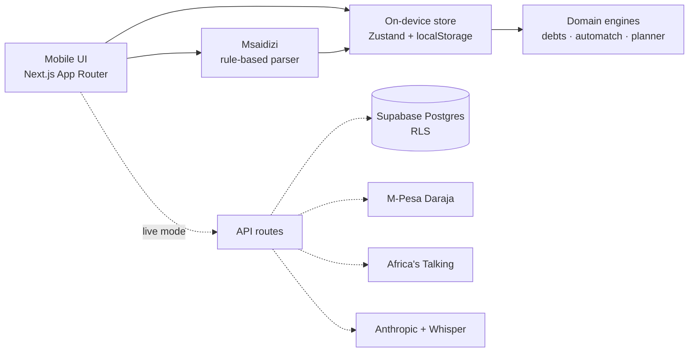

# Hotel System

**Biashara yako. Kwenye simu yako.** The operating system for Kenya's hotels (vibanda): madeni, mauzo, M-Pesa and an AI assistant that speaks Swahili, Sheng and English.

Demo hotel: **Nourish Hotel** (owner: Mama Mary), Kangemi, Nairobi.

## Quick start
```bash
npm install
npm run dev
```
Open http://localhost:3000 on your phone (same Wi-Fi) or in Chrome DevTools mobile view. No keys needed: `MOCK_MODE=true` runs everything on-device with 60 days of realistic seed data.

## What works today
| Screen | Route | Highlights |
|---|---|---|
| Leo (Home) | `/dashboard` | Scoreboard profit, Faida Meter vs 7-day avg, alerts, live feed, speed-dial |
| Madeni | `/dashboard/madeni` | Aging tabs, swipe to pay / remind, keypad, confetti + SMS receipt |
| Mauzo | `/dashboard/mauzo` | POS tiles, thumb-zone total bar, credit sale, history |
| Matumizi | `/dashboard/matumizi` | Soko chips w/ price trends, donut |
| Oda | `/dashboard/oda` | Status rail, one-tap advance, customer SMS, new-order ding |
| Msaidizi | `/dashboard/msaidizi` | Offline Swahili agent, rich cards, voice notes (mock) |
| Settings | `/dashboard/settings` | Language, theme, M-Pesa simulator, SMS outbox |

Try in Msaidizi: *"Nimeuza ugali samaki mbili na chai moja, cash"*, *"Andika deni ya Otieno mia mbili hamsini"*, *"Leo nimepataje?"*.

## Stack
Next.js 15 · TypeScript (strict) · Tailwind CSS 4 · Motion · Zustand · Drizzle + Supabase · Vitest · Playwright. Hosting: Netlify (frontend) + Supabase (backend).

## Architecture


## Project docs
- `MASTERPROMPT.md`: full product spec (source of truth)
- `status.md`: live progress, decisions, what's next
- `.env.example`: every variable, all optional in mock mode
